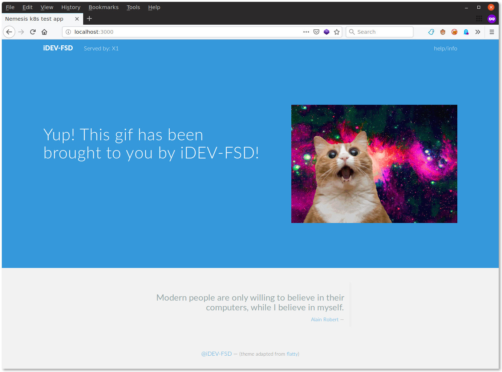

# cluster.k8s.testserver
A containerized node web server to use as a test application for k8s/openshift.

## About
The page does 4 things (but only one really needed):
  1. Shows the hostname (in the top of the page);
  1. Displays the ENV var `K8SSECRET`;
  1. Displays a animated lolcat (from [the cat api](https://thecatapi.com/));
  1. Displays a computer quote.

### Screenshot

## Commands

* Build the docker: `docker build . -t epflsi/k8s-testserver`
* To test locally the docker: `docker run -p 3000:3000 epflsi/k8s-testserver`
* Login into dockerhub: `docker login`
* Push the docker on dockerhub: `docker push epflsi/k8s-testserver`
* Create the pods and service with kubectl: `kubectl create -f k8s-testserver-deploy.yaml` or `kubectl create -f https://raw.githubusercontent.com/epfl-idevelop/cluster.k8s.testserver/master/k8s-testserver-deploy.yaml`
* Check the deployment with: `kubectl get all -o wide`
* To expose the pod with a k8s service, use: `kubectl expose rs k8s-testserver-1234567890`
* Get the service IP: `kubectl get all -o wide` and search for `service/k8s-testserver-1234567890`
* Check it out: `curl THE.SER.VIC.EIP:3000` (but it's indeed better looking in a browser)
