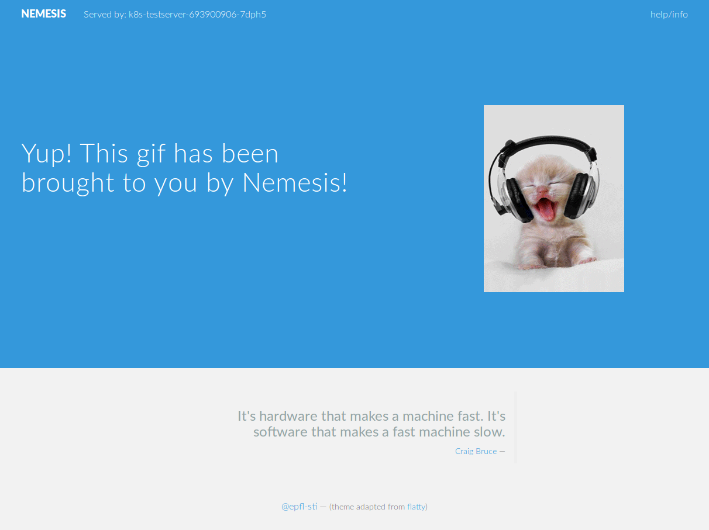

# cluster.k8s.testserver
A containerized node web server to use as a test application for k8s.

## About
The page does 3 things (but only one really needed):
  1. Show the hostname (in the top of the page);
  1. Display a animated lolcat (from [the cat api](http://thecatapi.com/));
  1. Display a computer quote.

### Screenshot

## Commands

* Build the docker: `docker build . -t epflsti/k8s-testserver`
* To test locally the docker: `docker run -p 3000:3000 epflsti/k8s-testserver`
* Login into dockerhub: `docker login`
* Push the docker on dockerhub: `docker push epflsti/k8s-testserver`
* Create the pods and service with kubectl: `kubectl create -f k8s-testserver-deploy.yaml` or `kubectl create -f https://raw.githubusercontent.com/epfl-sti/cluster.k8s.testserver/master/k8s-testserver-deploy.yaml`
* Check the deployment with: `kubectl get all -o wide`
* To expose the pod with a k8s service, use: `kubectl expose rs k8s-testserver-1234567890`
* Get the service IP: `kubectl get all -o wide` and search for `svc/k8s-testserver-1234567890`
* Check it out: `curl THE.SER.VIC.EIP:3000` (but it's indeed better looking in a browser)
